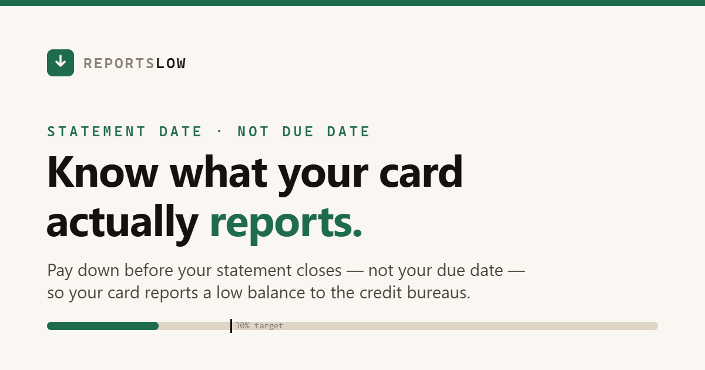

# ReportsLow

**Live tool: https://ababa1326.github.io/reportslow/**

Your credit card reports its balance to the credit bureaus on the **statement closing
date** — not your due date. Pay by the due date and you avoid interest, but the high
balance was already reported weeks earlier. ReportsLow tells you exactly how much to
pay down *before the snapshot* so your card reports low utilization.

## What it does

- Enter your credit limit, current balance, and either date you know — your **due date**
  (most people know this one; the closing date is estimated and clearly marked ≈) or your
  exact **statement closing date**
- Pick a target: 30% / 10% / under 10%
- Get the exact dollar amount to pay before closing, the resulting reported balance,
  and a live timeline of your cycle (cycle start → closing snapshot → due date)
- Download a repeating calendar reminder (.ics) that fires 3 days before each close —
  works with Google, Apple, and Outlook calendars

## Privacy

Everything runs in your browser. No accounts, no server, no analytics, no connection
to your bank — the numbers you type never leave the page.

## Tech

One self-contained `index.html`. Vanilla JavaScript, zero dependencies, no build step.
Hosted free on GitHub Pages.

## Related

[Statement Reminder](https://github.com/ababa1326/statement-reminder) — a Chrome
extension that keeps a badge countdown to your closing dates.

---

*Educational tool, not financial advice. Scoring models vary; confirm your closing date
in your card issuer's app.*
